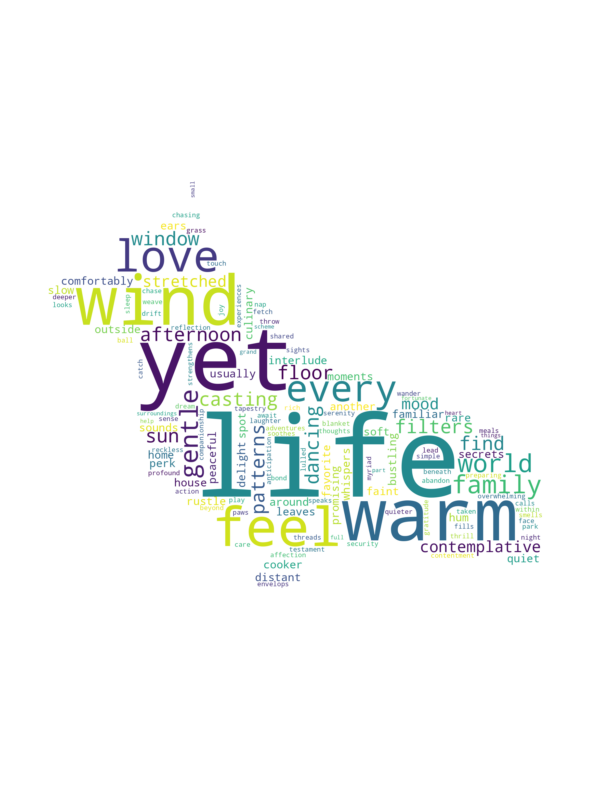
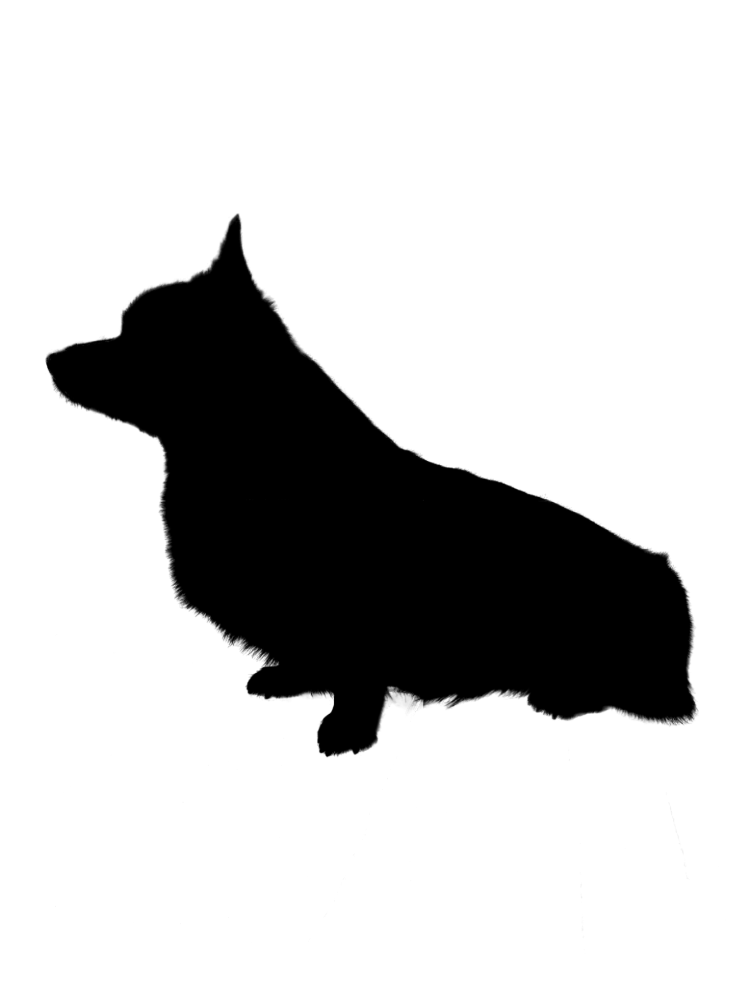

# Milo Word Cloud

This app displays words in the form of characters created in the word cloud.

An image like the one below will be output.



## Install Packages

```bash
pip3 install -r requirements.txt
```

## Image Preparation

Below is the original image.


Please create a mask file by blacking it out using Figma.

## Run

```bash
python3 main.py
```
